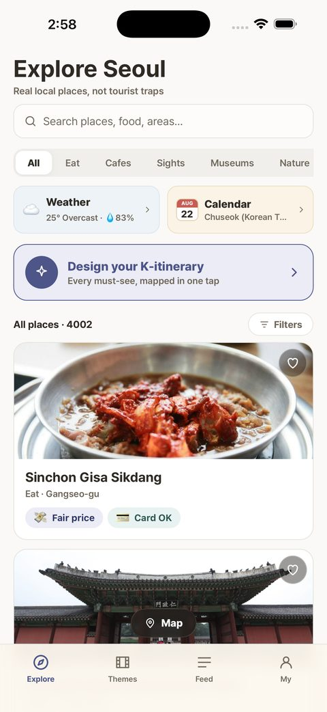
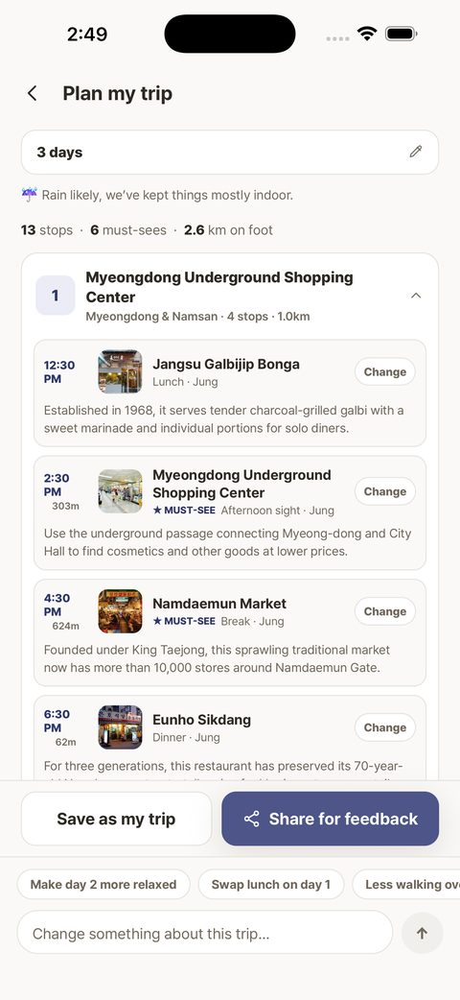
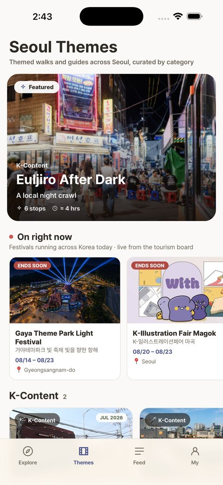
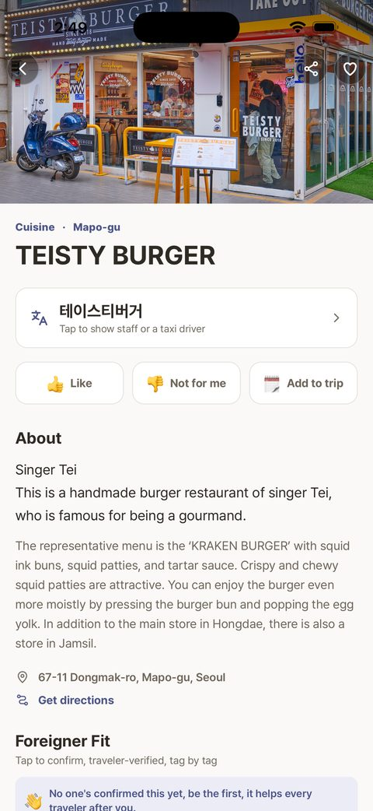

# BADA

외국인 여행자를 위한 서울 여행 iOS 앱 · [App Store](https://apps.apple.com/kr/app/bada-korea-travel-guide/id6797165977)

개발할 때 프로젝트명은 TRIP이었고, 출시하면서 BADA(바다)로 바꿨습니다. 저장소 이름은 TRIP을 그대로 씁니다.

<p>
  
  
  
  
</p>

## 소개

- 한국어를 모르는 외국인 여행자가 서울에서 장소를 찾고 여행 일정을 짤 수 있도록 돕는 앱
- 1인 개발: 기획, 디자인, 앱·서버 개발, 데이터 수집, 배포
- 2026년 7월 개발 시작, 2026년 9월 20일 App Store 출시 (v1.0)

## 주요 기능

| 기능 | 내용 |
|---|---|
| 장소 탐색 | 서울 장소 4,000여 곳의 영문 정보. 직원이나 택시 기사에게 보여줄 수 있는 한국어 이름 카드 |
| Foreigner Fit | 혼자 방문 가능 여부, 카드 결제, 가격 표시, 영어 응대를 여행자 투표로 기록 |
| 여행 일정 | 원하는 여행을 문장으로 입력하면 여러 날 일정을 생성하고, 대화로 수정 |
| 가이드 | 교통, 결제, 에티켓, 축제, K-콘텐츠 촬영지 등 29종 |
| 피드 | 질문, 일정 공유, 신고·차단 |

## 기술 스택

| 영역 | 사용 기술 |
|---|---|
| 앱 | Expo SDK 54, React Native 0.81, React 19, TypeScript, expo-router |
| 백엔드 | Supabase: PostgreSQL, Auth, Storage, Edge Functions (Deno) |
| AI | OpenAI API (구조화 출력), Apple Foundation Models (`@react-native-ai/apple`) |
| 지도 | 네이버 지도 (WebView), 네이버 지역 검색 |
| 외부 데이터 | 서울관광 API, 한국관광공사 TourAPI, 기상청 단기·중기 예보, 한국천문연구원 특일 정보 |
| 빌드·운영 | EAS Build, GitHub Actions |

## 구조

```
iOS 앱 (Expo)                    Supabase                         외부 API
 ├ 화면 (app/)          ──공개 키──▶  PostgreSQL (테이블 20개, RLS)
 ├ 도메인 로직 (lib/)       + RLS    Auth · Storage
 └ 기기 내 AI                        Edge Functions  ──비밀 키──▶  OpenAI, 기상청,
                                                                  관광 API, 네이버
                                            ▲
                         GitHub Actions ────┘ 데이터 갱신 · 백업
```

- 외부 API 키는 Edge Function secret에만 두고, 앱에는 Supabase 공개(anon) 키만 넣었습니다.
- 서버에 연결할 수 없을 때는 앱에 내장된 기본 데이터로 동작합니다.

## 폴더

```
app/                 화면 (expo-router). 탭 4개(탐색·테마·피드·마이) + 상세 화면
components/          공통 UI, 바텀시트
lib/                 도메인 로직
  dayPlan.ts         하루 일정 생성, 장소 점수 계산
  tripPlan.ts        여러 날 일정 생성 (지역 배정, 항공 시간 반영)
  tripIntake.ts      문장 → 일정 조건 (trip-intake 호출)
  tripChat.ts        대화형 수정 (trip-chat 호출)
  tripEdit.ts        장소 교체·삭제·추가
  prominence.ts      장소 등급 S/A/B
  foundationModels.ios.ts   기기 내 AI
data/                타입, 가이드 원본(seed.ts), Supabase 읽기·쓰기
scripts/             데이터 수집·정제·백필 스크립트
supabase/
  schema.sql, migration-*.sql   스키마와 마이그레이션
  functions/         Edge Functions 11개
docs/                운영 문서
```

## AI 사용 방식

- **문장으로 일정 만들기 (`trip-intake`)**: 사용자 문장을 분위기·관심사·속도·제외 항목으로 변환합니다. 값은 앱이 정한 목록 안에서만 고르도록 JSON Schema strict 모드를 씁니다.
- **대화로 일정 수정 (`trip-chat`)**: 요청을 `replace / remove / add / regenerate_day / set_vibe` 명령으로 변환합니다.
- **장소 선택은 AI가 하지 않습니다.** AI는 조건과 명령만 반환하고, 실제 장소는 `lib/dayPlan.ts`와 `lib/tripEdit.ts`가 DB에 있는 장소 중에서 고릅니다. 모르는 장소 ID가 오면 버립니다. 그래서 존재하지 않는 장소가 추천되지 않습니다.
- **기기 내 AI**: 점수 차이가 작은 후보만 Apple Foundation Models가 다시 고릅니다. 지원하지 않는 기기에서는 기존 결과를 그대로 씁니다.
- **데이터 보강 (`place-blurb`, `place-fit`)**: 앱에서 호출하지 않고 배치 스크립트로만 실행합니다. 태그는 장소 설명에 근거가 있을 때만 반영합니다.
- **비용 제한**: IP당 1분 12회 호출 제한과 OpenAI 계정 월 사용 한도를 걸어 두었습니다.

## 데이터

- 장소: 서울관광 API(영문·한국어 이름 연결)와 TourAPI에서 수집한 뒤 정제했습니다. 음식점 세부 분류는 네이버 지역 검색으로 보완했는데, 좌표 차이가 150m 이내인 결과만 반영했습니다.
- 자동 갱신 (GitHub Actions): 매일 종료된 행사를 정리하고, 매주 전체를 다시 수집하고, DB를 주 1회 백업합니다.

## 보안

- 모든 테이블에 RLS를 적용했습니다. 정책 코드만 보지 않고 익명 키로 직접 조회해 점검했습니다 (`supabase/migration-030-rls-audit-fixes.sql`).
- 투표 합계는 공개하고, 누가 투표했는지는 본인만 볼 수 있습니다.
- 서버 전용 함수는 내부 토큰으로 호출자를 확인합니다.

## 실행

```bash
npm install
cp .env.example .env     # 개발용 Supabase 키 입력
npx expo start           # 네이티브 모듈을 쓰므로 Expo Go가 아닌 dev client 필요
npx tsc --noEmit         # 타입 검사
```

데이터 수집, Edge Function 배포, 빌드·제출 명령은 [PROJECT.md](PROJECT.md)에 정리했습니다.

## 문서

- [PROJECT.md](PROJECT.md): 프로젝트 전체 설명 (영문)
- [docs/OPERATIONS.md](docs/OPERATIONS.md): 데이터 파이프라인과 운영
- [appstore-submission-checklist.md](appstore-submission-checklist.md): App Store 제출 절차와 심사 기록
